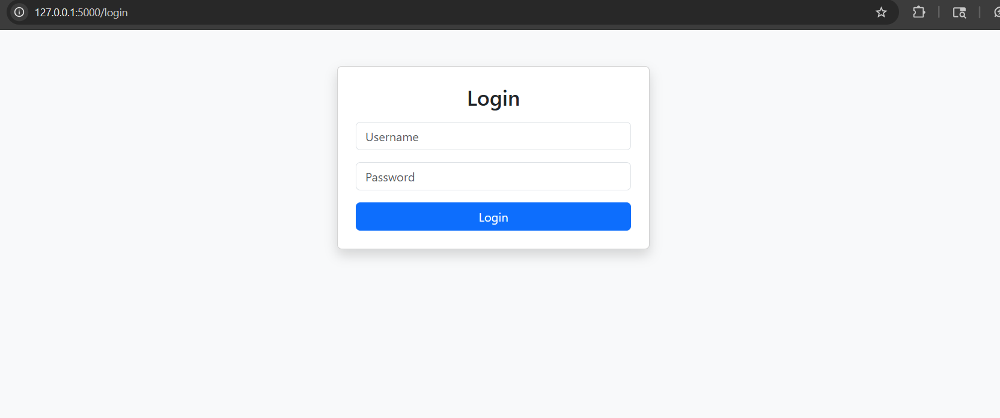
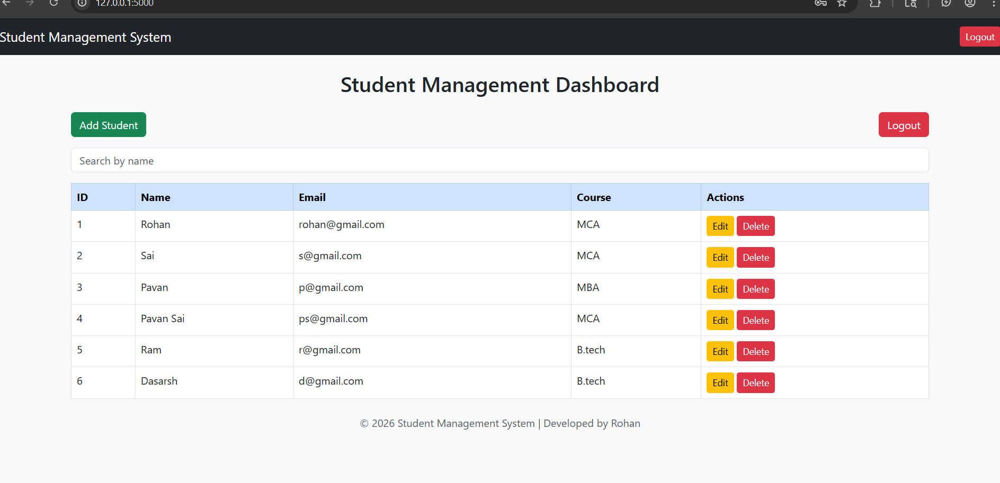
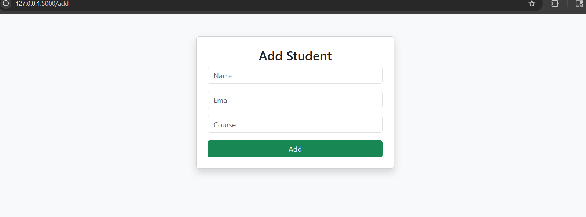

# 🎓 Student Management System

## 🚀 Overview
A full-stack web application built using **Python (Flask)** and **MySQL** to efficiently manage student records.  
The system includes authentication, CRUD operations, and search functionality with a modern Bootstrap UI.

---

## ✨ Key Features
- 🔐 Secure Login System (Session-based authentication)
- ➕ Add Student Records
- ✏️ Edit Student Details
- ❌ Delete Student Records (with confirmation)
- 🔍 Search Students by Name
- 🎨 Responsive UI using Bootstrap
- 🔔 Flash messages for better user experience

---

## 🛠️ Tech Stack
- **Backend:** Python (Flask)
- **Database:** MySQL
- **Frontend:** HTML, CSS, Bootstrap
- **Version Control:** GitHub

---

## 📸 Screenshots

### 🔐 Login Page

### 📊 Dashboard

### ➕ Add Student

---

## ⚙️ Installation & Setup

### 1. Clone the repository

### 2. Install dependencies
pip install flask mysql-connector-python

### 3. Setup MySQL Database
- Create database:
- Create tables:

---

### 4. Run the application
python app.py

---

### 5. Open in browser
http://127.0.0.1:5000/

---
## LIVE DEMO
https://student-management-system-jmqs.onrender.com/

---

## 📌 Project Highlights
- Built a complete **full-stack web application**
- Implemented **authentication and session management**
- Integrated **MySQL database with Flask backend**
- Designed a **responsive and user-friendly UI**

---

## 👨‍💻 Author
**Rohan Sakhamuru**

---

## ⭐ Future Improvements
- Password hashing for better security
- Pagination for large datasets
- Deployment on cloud (Render/Heroku)
